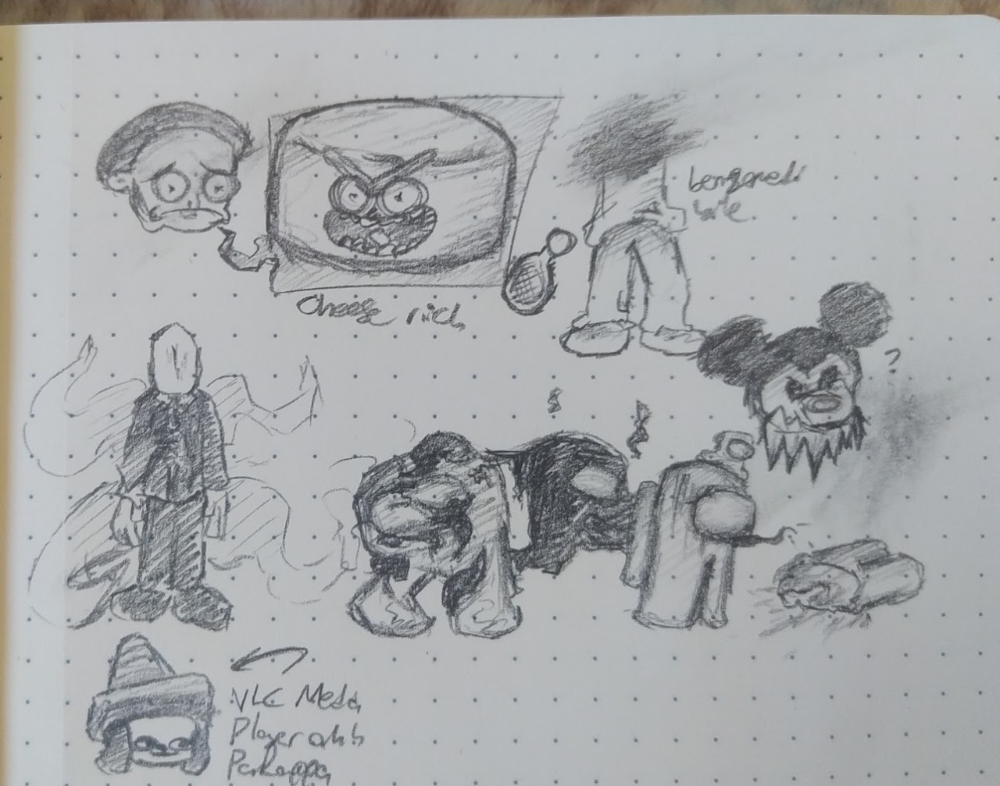
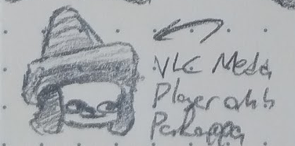

+++
title = 'VLC Media Player PaRappa'
+++

As you probably do('nt) know, I am interested in drawing stuff; and a few days ago (by that I mean two, relative to the time I wrote this entry) I drew some stuff:

<figcaption>The full drawing</figcaption>

As you know I am a PaRappa fan (*i think*) so I, for some reason, drew this:

<figcaption>VLC Media Player PaRappa, or as the locals call him: VLC Rappa</figcaption>

<strong class="title">Neat!</strong> I think. ı guess that's <strong class="title">Neat-</strong>
